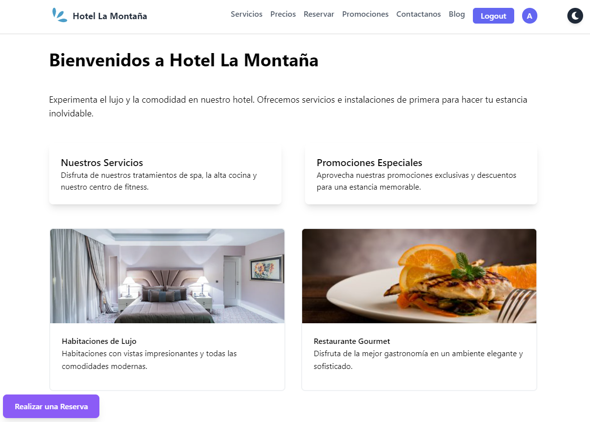

# Hotel La Montaña - Página Web SPA

## Descripción

Este proyecto de una Single Page Application (SPA), desarrollada con React, Vite, y React Router, ahora cuenta con un robusto sistema de autenticación JWT que incluye roles de usuario diferenciados, como moderadores y administradores. Además de las funcionalidades de registro y login, se ha añadido un panel de administrador para la gestión integral del contenido del hotel, junto con un panel para moderadores. Los usuarios autenticados pueden disfrutar de características adicionales, como dejar comentarios y valoraciones sobre el hotel, así como realizar reservas seguras a través de una integración con una API de pago. Esta aplicación también ofrece una experiencia de usuario mejorada con funcionalidades como la búsqueda avanzada, gestión de perfiles de usuario, y una sección dedicada a noticias y eventos del hotel. Todo ello complementado con una optimización SEO para mejorar la visibilidad en los motores de búsqueda y atraer más tráfico orgánico
## Características Principales

1. **Diseño y Responsividad:**
   - Utilización de flexbox y grid para un diseño atractivo y avanzado.
   - Totalmente responsive para adaptarse a diferentes dispositivos y resoluciones.
   - Implementación de animaciones y transiciones suaves para mejorar la experiencia del usuario.

2. **Contenido:**
   - Información detallada sobre servicios, horarios, precios y promociones especiales.
   - Sección de blog con artículos sobre turismo, consejos de viaje y guías turísticas relacionadas al estado de Venezuela.
   - Testimonios de clientes destacando los resultados obtenidos con los servicios del Hotel.

3. **React Router y Transiciones:**
   - Uso de React Router para una navegación fluida y amigable.
   - Implementación de transiciones animadas utilizando Framer Motion para efectos visuales sofisticados.

5. **Frameworks de CSS:**
   - Utilización de Tailwind CSS para agilizar el desarrollo y mejorar el aspecto visual.

7. **Formulario y Almacenamiento de Datos:**
   - Implementación de un formulario avanzado para realizar reservas.
   - Validación robusta en el formulario con mensajes de error claros.
   - Envío de correo electrónico al usuario con todos los detalles de la reserva y contactos para pagos posteriores.

## Instrucciones de Instalación y Uso

1. **Clonar el Repositorio:**

git clone https://github.com/arrayz-code/Front3.2
cd frontend-3.1

2. **Instalar Dependencias:**

npm install

3. **Ejecutar la Aplicación:**

npm run dev 

4. **Acceder a la Aplicación:**
Abre tu navegador y visita [http://localhost:5173](http://localhost:5173)

## Contribución

Si deseas contribuir al proyecto, sigue estos pasos:

1. Crea un nuevo *branch*: `git checkout -b feature/nueva-funcionalidad`
2. Realiza tus cambios y haz *commit*: `git commit -m 'Añadir nueva funcionalidad'`
3. Sube tus cambios al repositorio: `git push origin feature/nueva-funcionalidad`
4. Crea una nueva *Pull Request*

## Licencia

Este proyecto está bajo la Licencia MIT - ver el archivo [LICENSE.md](LICENSE.md) para más detalles.

## Creadores

Este proyecto fue desarrollado con amor y dedicación por el equipo de desarrollo. Agradecemos a cada miembro por contribuir y hacer posible esta experiencia única.

- [Arraiz Angel](https://github.com/arrayz-code)
- [Mariely Viloria](https://github.com/ely2547)

Si tienes alguna pregunta o comentario, no dudes en contactar a alguno de nuestros creadores. Estamos aquí para
